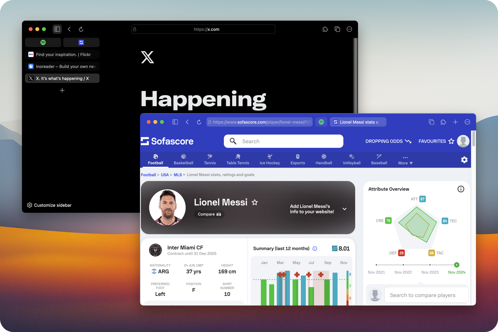

<h1 align="center"><strong>Neptune Firefox</strong></h1>

**Instructions:** 
- This theme works for **Firefox v132+** and is compatible with both Windows and macOS.
- To enable adaptive colors, you need to install the **[Adaptive Tab Bar Color](https://addons.mozilla.org/en-US/firefox/addon/adaptive-tab-bar-colour/?utm_source=addons.mozilla.org&utm_medium=referral&utm_content=search)** extension. 



## Installation

- Download the theme file and unzip the `chrome` folder into your `profile` folder.

- You can modify the wallpaper in the `userContent.css` file, and edit the file names for the light and dark modes

```css
body {
	background: url("neptune/image/RainbowLight.png") center/cover no-repeat fixed;

	@media (prefers-color-scheme: dark) {
		background: url("neptune/image/RainbowDark.png") center/cover no-repeat fixed;
	}
}
```

## Browser Configuration
- `about:preferences`

    - Set appearance to automatic.

-  `about:config`

    **Requirements**

    - Set `toolkit.legacyUserProfileCustomizations.stylesheets` to `true`.
    - Set `svg.context-properties.content.enabled` to `true`.
    - Set `widget.non-native-theme.use-theme-accent` to `true`.

    **Layout switch**

    - `sidebar.revamp` to `true` or `false`.
    - `sidebar.verticalTabs` to `true` or `false`.

- **Adaptive Tab Bar Color settings**

    - Set all values in the `Theme builder` to `0%`.
    - Configure `Advanced`
        - Light mode contrast:`21%`(Recommend)
        - Dark mode contrast:`3%`(Recommend)
        - Home page color light:`#f6f6f6`
        - Home page color dark:`#383838`

ENJOY!