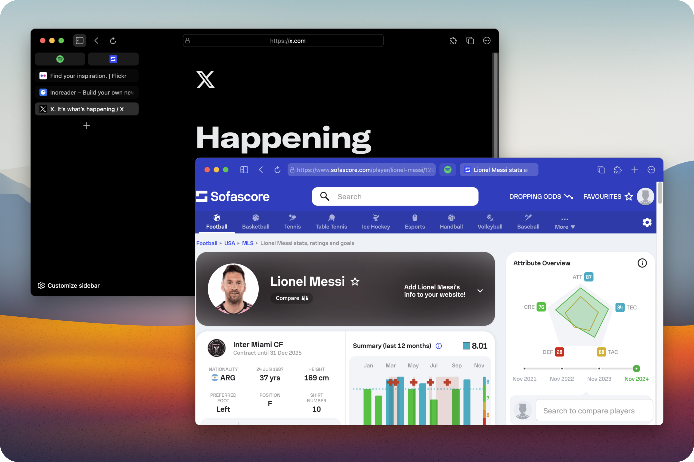

  

### *Instructions*
- Compatible with the latest Firefox on **Windows** & **macOS**.
- Requires the [Adaptive Tab Bar Color](https://addons.mozilla.org/firefox/addon/adaptive-tab-bar-colour) for dynamic colors. without it, tabs will render transparently.

### *Installation*
- Download the repository and place the unzipped chrome folder into your Firefox profile directory.
- Customize wallpapers by editing file names inside `userContent.css`.

### *Configuration*
- `toolkit.legacyUserProfileCustomizations.stylesheets` → `true`
- `svg.context-properties.content.enabled` → `true`
- `widget.non-native-theme.use-theme-accent` → `true`
- `widget.windows.uwp-system-colors.highlight-accent` → `true` *(Ignored on macOS)*
- Move all buttons to the Navigation Toolbar so no buttons remain on the Tabs Toolbar.
- Set all color values in **Adaptive Tab Bar Color** options (Theme Builder) to `0%`.

***ENJOY!***